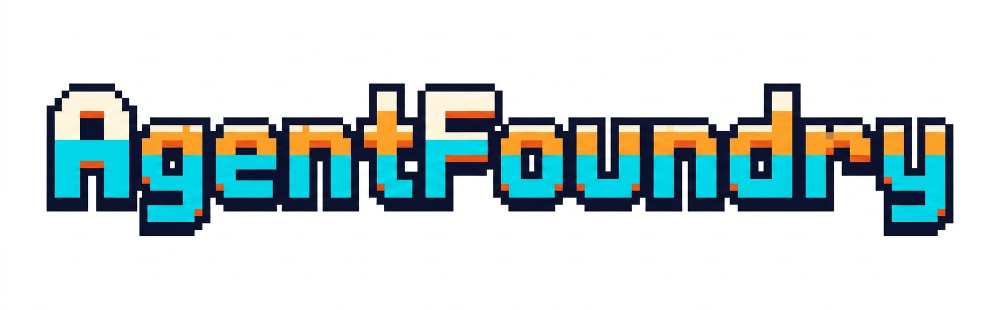

<div align="center">


[](https://github.com/unrealandychan/AgentFoundry/stargazers)
[](https://github.com/unrealandychan/AgentFoundry/network/members)
[](https://github.com/unrealandychan/AgentFoundry)
[](https://github.com/unrealandychan/AgentFoundry)

</div>

---

# AgentFoundry



> **Compose your AI project starter from skills, tools, and templates — test it live, then download in one click.**

AgentFoundry is a web-based scaffold composer for AI engineering projects. Think of it as **Spring Initializr meets Spec Kit for AI**: pick a base template, layer in curated skill packs (including importing directly from public GitHub repos), configure MCP server integrations, preview the generated file tree, test your agent live in-browser via the OpenAI SDK, then download a ready-to-run ZIP.

Need just one skill? Use **Download a Skill** mode to browse the built-in library, select the skills you want, and download them as a ready-to-drop-in ZIP — no need to build a full project.

---

## Getting Started

```bash
npm install
npm run dev
```

Open [http://localhost:3000](http://localhost:3000).

---

## Two Ways to Use

| Mode                    | When to use it                                                                                                                              |
| ----------------------- | ------------------------------------------------------------------------------------------------------------------------------------------- |
| **Build with Template** | Starting a new AI project — pick a template, compose skills, configure MCP servers, test live, download a full project ZIP                  |
| **Download a Skill**    | Already have a project — browse the skill library, select one or more skills, download as `skills.zip` to drop into your existing workspace |

The landing screen lets you choose a mode. Inside the wizard you can return to this screen at any time via the **← Home** link in the header.

---

## The 8-Step Wizard

| Step             | What you do                                                                                                          |
| ---------------- | -------------------------------------------------------------------------------------------------------------------- |
| 1 · Template     | Pick a base: Next.js AI App, Python Agent, CLI, RAG, Copilot Workspace, MCP Research Agent, Legal & Compliance Agent, HR Onboarding Agent, or Sales Outreach Agent |
| 2 · Skills       | Select built-in skills **or import from a public GitHub repo** (e.g. `JuliusBrussee/caveman`, `safishamsi/graphify`) |
| 3 · Integrations | Pick individual MCP servers filtered by category (Dev Tools, Databases, Search & RAG, CRM, Cloud & Infra, etc.) or curated bundles |
| 4 · Customize    | Set project name and fill template variables                                                                         |
| 5 · Preview      | Inspect every generated file before downloading                                                                      |
| 6 · Test Agent   | Chat with your composed agent live — server-side API key, upload workspace files for agents to reference             |
| 7 · Download     | Get a ZIP with full project files + `setup.sh`, `setup.ps1`, `mcp.json`, `AGENTS.md`, `SKILLS.md`, `starter.yaml`    |
| 8 · Done         | Confirmation screen with quick-start instructions                                                                    |

---

## Features

### Download a Skill (Standalone Mode)

For users who already have an AI project and want to add a skill without going through the full wizard:

1. Choose **Download a Skill** from the landing screen
2. Search and filter skills by category (Engineering, Workflow, Documentation, Marketing)
3. Select any combination of skills
4. Click **Download skills.zip** — you get a ZIP containing `skills/{id}/SKILL.md` for each selected skill plus an `INSTALL.md` guide

**Installation:** drop the `skills/` folder into your project root and reference the skill files from your `AGENTS.md` or paste the `## Instructions` block directly into your `Agent()` constructor.

The `/api/skills/download` POST endpoint powers the download; it accepts `{ skillIds: string[] }` and returns `application/zip`.

### Skill Pack Composition

Skills are reusable persona/behavior bundles that merge into a single system prompt. Built-in skills include:

**Engineering**
- **Clean Code + DDD Review** — meaningful names, SRP, bounded-context discipline
- **Commit Hygiene** — Conventional Commits, husky, lint-staged enforcement
- **Coding Mentor** — explains before changing, small diffs, teaches tradeoffs
- **Senior Engineer** — production-grade code, clean architecture, tests
- **Debugger** — root-cause isolation, no unnecessary refactors
- **Test Engineer** — unit/integration/regression, testability-first
- **Refactoring Expert** — structure improvements without behavior changes
- **Security Reviewer** — OWASP Top 10, secrets, injection, permission audits

**Documentation & Content**
- **Documentation Writer** — setup guides, architecture docs, onboarding notes
- **Technical Writer** — Diátaxis-framework docs (tutorial/how-to/reference/explanation/changelog)
- **Spec Writer** — spec.md, acceptance criteria, task breakdowns (Spec Kit compatible)
- **Brand Voice Guardian** — tone consistency, style guide enforcement
- **Social Media Creator** — platform-native posts (Twitter, LinkedIn, Instagram)
- **Email Marketing Writer** — campaign copy, subject lines, sequences
- **Customer Success Writer** — onboarding emails, knowledge base articles
- **Pitch Deck Writer** — narrative structure, investor-ready decks
- **Market Research Analyst** — competitive landscapes, TAM/SAM/SOM, trend reports

**Design & UX**
- **UX Researcher** — study design, discussion guides, JTBD synthesis, affinity mapping

**Sales**
- **Sales Copywriter** — cold email, LinkedIn outreach, 3-touch sequences (AIDA/PAS frameworks)
- **Prospect Researcher** — pre-outreach intelligence briefings, ICP fit scoring, CRM entry

**Legal**
- **Legal Proofreader** — contract review, risky clause identification, redline suggestions
- **Contract Reviewer** — deep SaaS/NDA/MSA/employment audit with risk-tiered findings and compliance overlay

**HR**
- **Onboarding Coordinator** — welcome packets, 18-question FAQs, 30-60-90 day plans

### GitHub Repo Import

Paste any public GitHub URL and the app will:

1. Fetch the repo's root contents via the GitHub REST API (no auth required for public repos)
2. Scan for `skills/`, `prompts/`, `agents/`, `.github/`, `.cursor/` folders and top-level `CLAUDE.md`, `AGENTS.md` files
3. Parse each Markdown file into a `SkillManifest`
4. Let you review and select which skills to add to your pack

**Trending skill repos (Apr 2026):**

| Repo                                                                                | Stars  | Description                                                 |
| ----------------------------------------------------------------------------------- | ------ | ----------------------------------------------------------- |
| [JuliusBrussee/caveman](https://github.com/JuliusBrussee/caveman)                   | ⭐ 35k | Cuts token usage 65% with minimal "caveman" speak           |
| [santifer/career-ops](https://github.com/santifer/career-ops)                       | ⭐ 35k | 14 skill modes for AI-powered job search & batch processing |
| [safishamsi/graphify](https://github.com/safishamsi/graphify)                       | ⭐ 28k | Turns any codebase into a queryable knowledge graph         |
| [coreyhaines31/marketingskills](https://github.com/coreyhaines31/marketingskills)   | ⭐ 22k | CRO, copywriting, SEO, analytics & growth engineering       |
| [blader/humanizer](https://github.com/blader/humanizer)                             | ⭐ 14k | Removes AI-writing signatures for natural-sounding output   |
| [travisvn/awesome-claude-skills](https://github.com/travisvn/awesome-claude-skills) | ⭐ 11k | Curated index of Claude skills & workflow tools             |

### MCP Server Integration

35 individual MCP servers across 9 categories, filterable in the UI. Bundles are pre-selected combinations for common workflows.

**Dev Tools** — Filesystem, Memory, Sequential Thinking, Git, GitHub, GitLab, Time, Sentry

**Databases** — PostgreSQL, Supabase, MySQL, MongoDB, Redis

**Search & RAG** — Fetch, Brave Search, Tavily Search, Exa Search, Firecrawl, DeepWiki

**Productivity** — Notion, Slack, Linear, Zapier

**CRM** — HubSpot, Salesforce, Attio

**Cloud & Infra** — AWS, Google Cloud, Kubernetes

**Browser & QA** — Puppeteer, Playwright, E2B Code Interpreter

**Design** — Figma

**General** — Composio (200+ pre-built connectors)

Pre-built bundles (15 total): **Basic Coding**, **Research**, **GitHub Coding**, **Documentation**, **Planning**, **Security Review**, **QA & Testing**, **Data Analysis**, **Marketing & Content**, **Google Workspace**, **Legal & Compliance**, **HR Onboarding**, **Sales & CRM**, **Design & UX**, **DevOps & Cloud**.

### Live Agent Test (OpenAI SDK)

Step 6 lets you chat with your composed system prompt before downloading:

- **No browser API key** — `OPENAI_API_KEY` is read from the server environment (`.env.local`). Set `OPENAI_BASE_URL` to use any OpenAI-compatible endpoint: Ollama (`http://localhost:11434/v1`), LM Studio (`http://localhost:1234/v1`), Azure OpenAI, and more.
- **Session workspace** — upload text files (`.md`, `.ts`, `.py`, `.json`, `.yaml`, `.sh`, `.sql`, `.tf`, `.go`, …) and all agents in the session automatically receive those files as context in their system prompt. Files are stored under `/tmp/{sessionId}/` on the server and scoped to your browser session.
- **Multi-agent orchestration** — when multiple skills are selected, an orchestrator routes each message to the best-matched specialist agent
- The `/api/test-agent` route handler proxies to OpenAI with streaming; API keys are never surfaced in error messages
- Fully optional — the Download button is always accessible

### Generated File Structure

Every downloaded ZIP contains:

```
{project-name}/
├── README.md
├── AGENTS.md          ← full composed system prompt by agent section
├── SKILLS.md          ← skill index with descriptions
├── .env.example       ← env vars from selected MCP integrations
├── mcp.json           ← Claude/Cursor-compatible MCP server config
├── setup.sh           ← bash bootstrap script
├── setup.ps1          ← PowerShell bootstrap script
├── starter.yaml       ← reproducibility manifest
└── .github/copilot-instructions.md  ← (agent-target specific)
```

---

## Tech Stack

| Layer                      | Technology                                        |
| -------------------------- | ------------------------------------------------- |
| Frontend                   | Next.js 14 App Router + TypeScript + Tailwind CSS |
| API                        | Next.js Route Handlers                            |
| Schema validation          | Zod                                               |
| ZIP generation             | JSZip                                             |
| Live chat proxy            | OpenAI npm SDK (streaming)                        |
| GitHub import              | GitHub REST API (public repos, no auth)           |
| Skill storage (default)    | Local disk — `skills/<id>/SKILL.md`               |
| Skill storage (cloud)      | AWS S3 via `@aws-sdk/client-s3`                   |
| Skill storage (enterprise) | MongoDB (`mongodb` npm package)                   |

---

## Skill Storage Bindings

Skills are stored as `SKILL.md` files through a pluggable **`SkillFileBinding`** layer. The active binding is selected automatically by environment variable — no code changes needed to switch.

| Binding             | When active          | Storage location                                    |
| ------------------- | -------------------- | --------------------------------------------------- |
| **Local** (default) | No special env vars  | `skills/<id>/SKILL.md` on the server filesystem     |
| **S3**              | `S3_BUCKET` is set   | `s3://{S3_BUCKET}/{S3_PREFIX}{id}/SKILL.md`         |
| **MongoDB**         | `MONGODB_URI` is set | MongoDB collection (takes precedence over S3/Local) |

All bindings support full CRUD — create, read, update, and delete via the REST API (`POST /api/skills`, `GET/PUT/DELETE /api/skills/:id`).

### Local binding (default)

No configuration needed. Skills are read and written directly to the `skills/` folder in the project root.

```
skills/
├── senior-engineer/
│   └── SKILL.md
└── debugger/
    └── SKILL.md
```

To add a skill at runtime: `POST /api/skills` with a `SkillManifest` JSON body — a new `skills/<id>/SKILL.md` is created on disk.

### S3 binding

Set the following environment variables:

```bash
S3_BUCKET=my-agentfoundry-skills   # required
S3_REGION=us-east-1                # optional, default us-east-1
S3_PREFIX=skills/                  # optional, default "skills/"

# AWS credentials (pick one method):
AWS_ACCESS_KEY_ID=...
AWS_SECRET_ACCESS_KEY=***
# — or — use ~/.aws/credentials, EC2 instance role, ECS task role, etc.
```

Skills are stored as `{S3_PREFIX}{id}/SKILL.md` objects (e.g. `skills/senior-engineer/SKILL.md`).

### MongoDB binding

Set `MONGODB_URI` to a MongoDB connection string. The collection is seeded from disk on first run. Takes precedence over S3/Local.

---

## Project Structure

```
src/
├── app/
│   ├── api/
│   │   ├── generate/route.ts           ← ZIP assembly endpoint
│   │   ├── import-repo/route.ts        ← GitHub repo scanner
│   │   ├── skills/
│   │   │   ├── route.ts                ← GET/POST skill CRUD
│   │   │   ├── [id]/route.ts           ← GET/PATCH/DELETE single skill
│   │   │   └── download/route.ts      ← POST {skillIds} → skills.zip
│   │   ├── test-agent/route.ts         ← OpenAI streaming proxy (server-side key + baseURL)
│   │   └── workspace/upload/route.ts  ← session file upload (/tmp/{sessionId}/)
│   ├── layout.tsx
│   ├── page.tsx
│   └── globals.css
├── components/
│   ├── flow-chooser.tsx              ← landing screen (Build vs Download mode)
│   ├── skill-download-flow.tsx        ← standalone skill browser + ZIP download
│   └── wizard/
│       ├── wizard-layout.tsx
│       ├── step-choose-template.tsx
│       ├── step-add-skills.tsx
│       ├── step-add-integrations.tsx
│       ├── step-customize.tsx
│       ├── step-preview.tsx
│       ├── step-test-agent.tsx
│       ├── step-download.tsx
│       └── github-import-panel.tsx
├── lib/
│   ├── schemas.ts         ← Zod schemas for all inputs
│   ├── skill-bindings.ts  ← SkillFileBinding interface + Local + S3 implementations
│   ├── skill-loader.ts    ← SKILL.md parser + serializer (disk loader)
│   ├── skill-store.ts     ← SkillStore factory (Local / S3 / MongoDB)
│   ├── skill-linter.ts    ← lint scorer for Skill Builder
│   └── composer.ts        ← merges template + skills + integrations → files
├── registry/
│   ├── templates.json
│   ├── skills.json
│   └── integrations.json
└── types/
    └── index.ts
```

---

## Security

- OpenAI API keys are validated (`sk-` prefix), used only in the proxied request, and never persisted
- API keys are scrubbed from error messages before returning to the client
- GitHub import uses only the public REST API — no tokens, no credentials
- Input validation via Zod on every route handler

---

## License

MIT